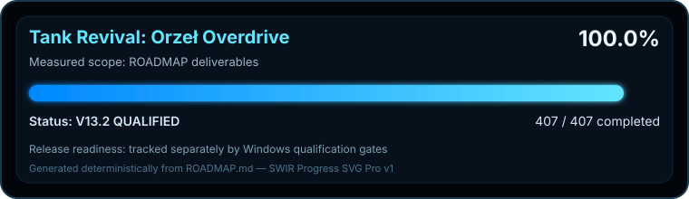

<!-- SWIR-README-STANDARD:v2 -->

<div align="center">


<br>

**A 2.5D top-down tank-defense action game built in Unity 6 for Windows.**

Defend the **Orzełek stronghold** through a 100-round campaign of armored assaults, specialist formations, supply warfare, electronic operations, adaptive enemy doctrine and multi-phase boss battles.

[](https://github.com/Swir/Tank-Revival-Overdrive/releases)
[](https://unity.com/)
[](ROADMAP.md)
[](https://github.com/Swir/Tank-Revival-Overdrive/actions/workflows/battlefield-sensor-fusion-v136-windows.yml)

[**Highlights**](#-highlights) · [**Download**](#-quick-start--download) · [**Controls**](#-controls) · [**Roadmap**](#-roadmap--quality-gates) · [**Releases**](#-releases)

</div>


<!-- SWIR-PROGRESS-SVG-PRO:v1 -->
<p align="center"></p>
<p align="center"><sub>Roadmap progress: 439 / 447 completed (98.2%) — V13.7 IN DEVELOPMENT. Release readiness is tracked separately by Windows qualification gates.</sub></p>

---

## 📌 Project Status

| Item | Status |
|---|---|
| Development milestone | **V13.7 IN DEVELOPMENT** on `dev-v13-7` |
| Roadmap | **439 / 447 completed (98.2%)** — authoritative `ROADMAP.md` scope |
| Primary platform | **Windows 10 / 11 x64** |
| Development engine | **Unity 6000.3.17f1** |
| Latest qualified milestone | **v13.6** — exact Windows candidate qualified |
| Latest public demo | **v6.3.0-demo** — prerelease |
| Latest stable release | **v2.2.0** |
| Public release readiness | Tracked separately from roadmap completion by packaged Windows gates |

`ROADMAP.md` is the authoritative source for milestone completion. A checkbox is completed only after the corresponding implementation exists and its required verification has passed.

## 🎮 What is Tank Revival?

Tank Revival: Orzeł Overdrive is an original top-down armored action game focused on defending the Orzełek stronghold while the battlefield becomes increasingly complex across 100 rounds.

The campaign combines direct tank combat with directional armor, component damage, special ammunition, field repair, tactical enemy roles, dynamic objectives, supply and route pressure, electronic warfare, fire-support intelligence and deterministic encounter escalation. Every tenth round becomes a boss assault, while late-game pressure stays inside explicit runtime and CI budgets instead of relying on uncontrolled spawn growth.

## ⚡ Highlights

| Feature | What it changes in play |
|---|---|
| 🦅 **Orzełek defense** | Protect a persistent stronghold whose defenses and battlefield pressure escalate through the campaign. |
| 💯 **100-round encounter campaign** | Deterministic encounter planning creates controlled escalation from round 1 to 100. |
| 🧠 **Adaptive enemy command v13.2** | A bounded 8-round combat history can shift enemy doctrine between seven tactical responses without creating a second AI/movement authority. |
| 🧩 **Battlefield cohesion v13.3** | Fixed-capacity four-vehicle squads add deterministic roles, leader-loss shock, regroup intent and readable command markers while existing `EnemyTank` remains movement/fire authority. |
| 🧱 **Tactical terrain v13.4 — qualified** | Deterministic cover overlays add bounded brick, steel and water layouts, safe-route preservation and breach-aware squad movement while canonical `Obstacle` damage authority remains unchanged. |
| 🌦️ **Battlefield weather v13.5 — qualified** | Deterministic Clear, Mist, Rain, Storm and Snow fronts change bounded traction, visibility, spread and reload pressure while AP/Plasma retain measured precision counterplay and existing movement/ballistics authorities remain canonical. |
| 📡 **Sensor fusion v13.6 — qualified** | Battlefield-wide Unknown/Detected/Tracked/Verified contact confidence fuses distance, class signature, weather, terrain and existing Recon/EW telemetry; a finite active sweep improves information only and never replaces targeting, movement or damage authority. |
| ⚙️ **Late-round performance v13.7 — in development** | Proactive battle-density pressure budgets reduce optional FX/presentation churn during rounds 80/90/100 while preserving enemy counts, gameplay events and canonical combat authority. |
| 🎯 **Dynamic objective warfare** | Objective planning layers mission pressure onto the existing round/spawn loop instead of replacing it. |
| 👑 **Multi-phase bosses** | Boss behavior escalates through health/component-driven phases while existing movement, projectile and survivability authorities remain canonical. |
| 🛡️ **Directional armor & modules** | Front/side/rear armor, ricochets and engine/tracks/gun/ammo-rack degradation affect how vehicles move and fight. |
| 🔧 **Emergency repair warfare** | Limited, interruptible field repair can recover damaged modules without healing vehicle HP. |
| 💥 **7 ammunition modes** | Standard, AP, HE, Incendiary, EMP, Twin Shot and Plasma provide distinct anti-armor, area, disruption and penetration roles. |
| 🚜 **8 enemy classes** | Basic, Fast, Heavy, Sniper, Siege, Elite, Supply and Boss units create different target and positioning priorities. |
| 📡 **Operational warfare stack** | Combined Arms, sustainment, route intelligence, Recon/EW, Mobile Signal and SIGINT feed bounded encounter decisions. |
| 🎯 **Independent hull and turret control** | Drive, aim and fire independently instead of locking the cannon to chassis direction. |
| ✨ **Procedural 2.5D presentation** | Animated tracks, recoil, muzzle flashes, trails, smoke, sparks, explosions, tactical telegraphs and pooled combat feedback. |
| 🧪 **Exact-candidate qualification** | v13.6 passed one packaged Windows EXE through production-audio preflight, v13.6 sensor-fusion smoke, v13.5/v13.4/v13.3 regressions and late-round 80/90/100 soak. |

## 🔫 Ammunition

| Key | Ammunition | Battlefield role | First available |
|---:|---|---|---:|
| 1 | Standard | Unlimited general-purpose shell | Round 1 |
| 2 | AP Piercing | Faster anti-armor shot with stronger penetration and reduced ricochet risk | Round 3 |
| 3 | HE Explosive | Area pressure against enemies and destructible brick cover | Round 8 |
| 4 | Incendiary | Damage-over-time pressure and rear/engine threat | Round 15 |
| 5 | EMP Shock | Temporary movement/weapon disruption with strong subsystem pressure | Round 25 |
| 6 | Twin Shot | Two parallel projectiles for wider close/mid-range pressure | Round 35 |
| 7 | Plasma | Fast, high-damage, multi-penetrating anti-armor projectile | Round 50 |

Use **Q / E** to cycle through ammunition currently in inventory. Supply Tanks can provide additional ammunition during the campaign.

## 🚀 Quick Start / Download

### Recommended — packaged Windows build

1. Open the repository **Releases** page.
2. Download a Windows x64 ZIP from the release you want to run.
3. Extract the **entire** archive to its own folder.
4. Run `TankRevivalOverdrive.exe`.
5. Keep `TankRevivalOverdrive_Data` beside the executable.

Unity is **not required** to play a packaged Windows build.

- Public demo: [`v6.3.0-demo`](https://github.com/Swir/Tank-Revival-Overdrive/releases/tag/v6.3.0-demo)
- Stable release: [`v2.2.0`](https://github.com/Swir/Tank-Revival-Overdrive/releases/tag/v2.2.0)
- All releases: https://github.com/Swir/Tank-Revival-Overdrive/releases

> A qualified development milestone is not automatically a public release. Use the Releases page for actual downloadable public versions.

### From source

Clone the repository and open the Unity project with the editor version used by current CI:

```bash
git clone https://github.com/Swir/Tank-Revival-Overdrive.git
cd Tank-Revival-Overdrive
```

Active milestone work lives on dedicated `dev-vX-Y` / `dev-vX.Y` branches. For reproducible development builds, match the Unity version declared by the branch CI instead of assuming the latest editor is compatible.

## 💻 Requirements / Compatibility

| Requirement | Current project target |
|---|---|
| OS | Windows 10 / 11 x64 |
| Packaged game | Portable ZIP containing EXE + `_Data` runtime |
| Unity required to play | No |
| Source development | Unity 6000.3.17f1 for the current Windows qualification path |
| Input | Keyboard + mouse |

Other platforms are not advertised as supported unless a dedicated verified build exists.

## 🎮 Controls

| Input | Action |
|---|---|
| **WASD / Arrow keys** | Move and turn the hull |
| **Mouse** | Aim the turret independently |
| **Left Mouse / Space / Left Ctrl** | Fire |
| **Q / E** | Previous / next available ammunition |
| **C** | Active sensor sweep when v13.6 sensor fusion is available and off cooldown |
| **1–7** | Directly select ammunition type |
| **R** | Attempt emergency field repair when the repair system permits it |
| **P / Escape** | Pause / resume |
| **Enter / Space** | Start/restart and deploy from the Command Center where applicable |
| **1–6 in Command Center** | Purchase the corresponding permanent upgrade |
| **7 in Command Center** | Repair Orzełek when that command action is available |

## 🧠 Combat & Campaign Systems

### Armor and component warfare

Vehicle survivability stays under the canonical `Health` authority, while `ArmorSystem` resolves directional protection and progressive module degradation. Engine, tracks, gun and ammunition-rack state can affect mobility, reload, weapon function and AI casualty behavior without creating a second HP model.

### Encounter and objective stack

`EncounterPlannerV130` deterministically plans the 100-round campaign with explicit enemy-count, concurrency and spawn-cadence limits. Objective warfare layers additional mission intent over that plan while the live campaign still consumes all spawning through the existing `TankGame` authority.

The cross-system doctrine layer reads bounded public state from Mobile Front, Operational Sustainment, Route Intelligence, Recon/EW, Mobile Signal and SIGINT. It adjusts pressure only inside hard limits and does not take control of those systems, movement, damage, projectiles or rewards.

### Adaptive Enemy Command v13.2

`AdaptiveEnemyCommandV132` observes a fixed eight-round combat-history window and selects between seven bounded doctrines with hysteresis and repeat caps. It can influence composition, concurrency, cadence and existing `EnemyTank` intent only within hard limits. A deterministic `RecoveryWindow` can reduce pressure after sustained player/Orzełek distress instead of using hidden healing, enemy deletion or invulnerability.

### Battlefield Cohesion v13.3

The qualified v13.3 layer adds a fixed-capacity squad registry for at most **24 eligible enemy actors / six four-vehicle squads**. Slots deterministically map to Leader, Wingman, Breacher and Support roles. Cohesion can transition through Forming, Cohesive, Shocked and Regrouping states; losing a leader creates a finite shock before deterministic promotion and regrouping. The director publishes bounded movement, reload, spread, target and cardinal formation intent only — it does not spawn, move, fire, damage or heal actors itself.

### Tactical Terrain & Cover Warfare v13.4 — qualified

The v13.4 branch adds a deterministic tactical overlay built from canonical `Obstacle` components. Per-round planning selects among seven terrain doctrines, caps the overlay at 12 cover nodes chosen from 24 bounded candidate slots, preserves the Orzełek/player corridor and enemy spawn exits, and mixes brick, steel and water within explicit budgets. `EnemyTank` receives only a bounded cardinal breach-aware direction hint; structural damage remains owned by `Obstacle`, spawning by `TankGame`, and movement/fire by existing enemy logic. The exact Windows candidate passed the full production-audio, v13.4 terrain, historical regression and rounds 80/90/100 soak matrix while preserving the existing gameplay authority boundaries.

### Battlefield Weather & Visibility Warfare v13.5 — qualified

The v13.5 layer deterministically assigns Clear, Mist, Rain, Storm or Snow across the 100-round campaign. Weather supplies bounded traction, visibility, spread and enemy-reload multipliers through the existing `PlayerTank`, `EnemyTank`, `Rigidbody2D` and fire-control paths; it does not create a second movement, projectile, damage or round authority. Rain, Snow and Storm couple conservatively to canonical `TacticalTerrainMap` surfaces, AP/Plasma reduce only the player spread penalty, and presentation is capped at 24 deterministic weather streaks. The exact Windows candidate passed the authored-audio preflight, v13.5 weather smoke, v13.4/v13.3 regressions and rounds 80/90/100 soak on the same executable.

### Battlefield Sensor Fusion & Contact Warfare v13.6 — qualified

The v13.6 milestone adds a battlefield-wide informational contact layer above the existing combat authorities. Contact confidence is bounded to Unknown, Detected, Tracked or Verified and is derived from enemy class signature, range, v13.5 weather visibility, canonical `TacticalTerrainMap` concealment and the existing v12.3 Recon/EW signal-quality bridge. The runtime tracks at most 24 registered enemies and displays at most eight high-value contact markers; it does not hide enemies, choose targets, move tanks, spawn projectiles, deal damage or create a parallel economy.

A finite **C-key active sensor sweep** provides deliberate counterplay with hard range, duration and cooldown limits. When the existing Recon/EW logistics operation is active, the same input can request only its already-bounded counter-jamming window. Close-range and boss detection floors prevent weather or concealment from turning the information layer into unavoidable blindness. The exact v13.6 candidate `6509b163ab0fa2f29d88f2f9c06188f7a1de1bdb` passed Windows qualification run `35388766882`: production authored-audio preflight, v13.6 sensor-fusion smoke, v13.5/v13.4/v13.3 regressions and rounds 80/90/100 soak on the same packaged executable.

### Late-Round Performance & Battle Density Reforge v13.7 — in development

v13.7 targets late-campaign frame-pressure and presentation churn without lowering combat density. A deterministic Normal / Dense / Critical pressure profile will combine round band, live registered actors, active explosion pressure and the existing `WarfarePerformanceGovernor` tier, then tighten only optional presentation budgets. Projectile/Health/spawn/movement/targeting authority and enemy counts remain unchanged; the exact Windows gate must prove the same packaged EXE still passes v13.6+ regressions and rounds 80/90/100 soak before any v13.7 checkbox can close.

### Orzełek escalation

Late-campaign defense can strengthen the flanking shoulders while preserving a destructible center approach. This keeps a visible breach route for standard loadouts instead of turning high-tier defense into an inaccessible objective wall.

## 🧱 Technology & Authority Model

| Area | Implementation |
|---|---|
| Engine | Unity 6 / C# |
| Rendering | Procedural 2.5D gameplay presentation |
| Player/enemy survivability | Canonical `Health` |
| Projectile collision/damage flow | Canonical `Projectile` / existing spawn path |
| Round and spawn ownership | `TankGame` |
| Enemy movement/weapon ownership | Existing `EnemyTank` / Rigidbody2D combat path |
| Tactical/operational layers | Bounded directors and read-only integration snapshots |
| Windows CI | GitHub Actions + Unity builder + deterministic packaging/provenance checks |
| CI bootstrap | Versioned static `Assets/Scenes/Bootstrap.unity`; headless build does not create/save scene assets |
| Regression strategy | Same packaged EXE through current smoke, historical regressions and late-round soak |

The project intentionally avoids parallel damage, movement and economy authorities when new tactical layers are introduced.

## 🗺️ Roadmap & Quality Gates

The authoritative roadmap is [`ROADMAP.md`](ROADMAP.md). The current scoped state is **439 / 447 (98.2%) — V13.7 IN DEVELOPMENT**. Release readiness is tracked separately by exact-candidate Windows qualification gates.

Recent qualified milestone layers include v13.0 encounter/boss warfare, v13.1 objective warfare, v13.2 adaptive enemy command and v13.3 battlefield cohesion. The v13.3 exact-candidate gate required source/authority contracts, a clean Unity Windows x64 build, deterministic packaging and one exact packaged EXE running production-audio preflight, v13.3 cohesion smoke, v13.2/v13.1/v13.0/v12.9/v12.8 regressions and late-round soak covering rounds 80 / 90 / 100.

The qualified v13.4 candidate is `ef891049f2c40bf797b4b6e7f38b12c1c25ec407`; Windows qualification run `35336689226` completed successfully. The same packaged EXE passed production authored-audio preflight, v13.4 tactical-terrain smoke, v13.3/v13.2/v13.1/v13.0/v12.9/v12.8 regressions and rounds 80/90/100 soak.

The qualified v13.5 candidate is `9dca37bb93d10fda44bcfb17b82a8ea0f92f065e`; Windows qualification run `35371602843` completed successfully. The same packaged EXE passed production authored-audio preflight, v13.5 Battlefield Weather smoke, v13.4 tactical-terrain regression, v13.3 battlefield-cohesion regression and rounds 80/90/100 soak.

## 📦 Releases

A qualified development branch does **not** automatically replace the public release line.

- **Latest public demo:** `v6.3.0-demo` (prerelease)
- **Latest stable release:** `v2.2.0`
- **Development milestone:** v13.7 is in development on `dev-v13-7`; v13.6 remains the latest qualified development milestone and neither state is automatically a new public release.

This separation keeps public downloads distinct from qualified-but-not-yet-published development milestones.

## 🎨 Creative Direction

Tank Revival: Orzeł Overdrive is an original project with its own code, project branding and procedural game presentation. It uses broad top-down tank-action conventions but does not depend on ripped maps, sprites, audio or other assets from existing games.

## 🔎 Search Keywords

`tank defense game` • `Windows tank game` • `2.5D tank action` • `top down tank game` • `Unity 6 game` • `C# Unity game` • `100 round campaign` • `adaptive enemy AI` • `squad command AI` • `tactical terrain game` • `battlefield weather game` • `sensor fusion tank game` • `late round performance` • `battle density optimization` • `boss tank battles` • `tank armor simulation` • `component damage system` • `special ammunition game` • `Orzelek defense` • `Unity GitHub Actions`

---

<div align="center">

### `DEFEND • ADAPT • OVERDRIVE`

Built and maintained by **SWIR**.

⭐ **If Tank Revival is useful or fun to follow, consider leaving a star.**

[**← SWIR profile**](https://github.com/Swir) · [**All projects →**](https://github.com/Swir?tab=repositories)

</div>
